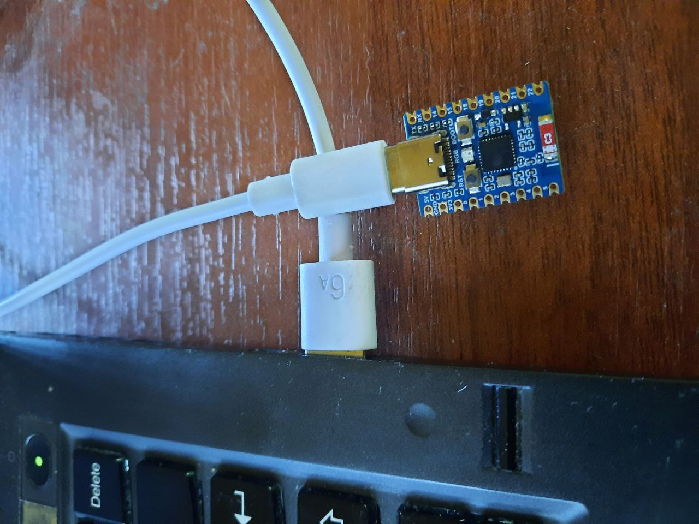

# ImGui_OpenCv

## Описание

Проект **ImGui_OpenCv** объединяет возможности библиотеки [Dear ImGui](https://github.com/ocornut/imgui) 
и [OpenCV](https://opencv.org/) для создания графических интерфейсов пользователя (GUI) и обработки изображений. 
Этот проект предоставляет инструменты для интеграции ImGui с OpenCV, что позволяет легко создавать интерактивные приложения 
для обработки изображений.

## Возможности

- Интеграция Dear ImGui и OpenCV
- Примеры использования ImGui для отображения и сохранения видео
- Тестирование графиков с данными, принимаемыми по COM-порту от микроконтроллера
- Простая настройка и запуск проекта

## Конфигурация

Проект использует файл конфигурации `imgui.ini`, который создаётся при первом запуске приложения. В этом файле запоминается положение окна перед закрытием приложения, а также можно изменить префикс данных COM-порта. 

Пример содержимого файла `imgui.ini`:

[CustomSettings] 

Mode=2 

Com-port=/dev/ttyACM0 

baud_rate=115200 (без разницы, если мы используем виртуальный com-порт)

data_prefix=data

[MainWindow] PosX=373 PosY=69

### Параметры

- **Mode**: Режим работы (1, 2 или 3).
- **Com-port**: Путь к COM-порту (например, `/dev/ttyACM0`) (Запоминается , но пока не используется)
- **baud_rate**: Скорость передачи данных (например, `115200`) 
- **data_prefix**: Префикс данных. После этого ключевого слова будет считываться значение, отображаемое на графике.
- **PosX**: Позиция окна по оси X.
- **PosY**: Позиция окна по оси Y.

### Передача данных по COM-порту

Данные по COM-порту передаются в ASCII кодах. Убедитесь, что микроконтроллер отправляет данные в нужном формате. Пример валидных данных (каждое новое значение с новой строки):

I (6809) esp32: data 468

Для отображения на графике будет считываться целое значение, записанное после ключевого слова `data`. Это слово можно поменять в файле `imgui.ini`.

Для тестирования вы можете использовать проект с тестовой прошивкой микроконтроллера, который реализует отправку данных в необходимом формате: [esp32c3_test](https://github.com/bauman-robotics/esp32c3_test).

Бинарный файл прошивки для отладочной платы ESP32-C6 SuperMini
(https://aliexpress.ru/item/1005006917431375.html?sku_id=12000038720440763&spm=a2g2w.productlist.search_results.13.68fb4af2fHbNJE)

Бинарный файл прошивки можно скачать по следующей ссылке:

- [Скачать файл](http://84.252.143.212:5100/download/esp32c3_test.bin)

## Скриншоты

### Режим 1: Отрисовка графика данных, получаемых по COM-порту

### Режим 2: Демонстрация видео с камеры 

### Тестовая плата отправляющая пакеты по ком-порту.

## Режимы работы

Проект поддерживает три режима работы:

1. **Режим без использования COM-порта и OpenCV**:
    - Демонстрация стандартных элементов управления: кнопки, списки, график координат Y мышки.
    
2. **Режим с использованием COM-порта**:
    - Отрисовка графика данных, получаемых от микроконтроллера.
    - Вывод информации о количестве принятых пакетов в секунду.
    
3. **Режим с использованием OpenCV**:
    - Демонстрация работы с OpenCV.
    - Вывод изображения со стандартной камеры.
    - Заморозка кадра.
    - Изменение размера кадра от минимального до максимального.
    - Сохранение видеофрагмента в файл.

## Установка

### Требования

- CMake 3.10 или выше
- Компилятор, поддерживающий C++17
- OpenCV 4.x
- Dear ImGui
- Библиотека для работы с COM-портом (используется `<termios.h>`)

### Сборка

1. Клонируйте репозиторий:

sh git clone https://github.com/bauman-robotics/ImGui_OpenCv.git cd ImGui_OpenCv

2. Создайте и перейдите в директорию сборки:

sh mkdir build cd build

3. Запустите CMake и соберите проект:

sh cmake .. cmake --build .

## Использование

После успешной сборки вы можете запустить проект, который находится в директории `build`. Например:

sh ./ImGui_OpenCv

### Режим 1: Демонстрация стандартных элементов управления

1. Запустите проект:

sh ./ImGui_OpenCv

2. В интерфейсе ImGui будут отображены кнопки, списки и график координат Y мышки.

### Режим 2: Отрисовка графика данных, получаемых по COM-порту

1. Подключите микроконтроллер к вашему компьютеру.

2. Убедитесь, что микроконтроллер посылает данные в нужном формате (ключевое слово, указанное в imgui.ini файле и целое число за ним для отображения на графике).

3. Запустите проект:

sh ./ImGui_OpenCv

4. В интерфейсе ImGui выберите нужный COM-порт.

5. Данные будут автоматически приниматься в отдельном потоке и отображаться в виде графиков в реальном времени.

6. Вывод информации о количестве принятых пакетов в секунду будет отображаться в интерфейсе.

### Режим 3: Демонстрация работы с OpenCV

1. Подключите стандартную камеру к вашему компьютеру.

2. Запустите проект:

sh ./ImGui_OpenCv

3. В интерфейсе ImGui будет отображаться изображение с камеры.

4. Используйте элементы управления для заморозки кадра, изменения размера кадра и сохранения видеофрагмента в файл.

## Сборка в VSCode под Ubuntu

Проект был собран в [Visual Studio Code](https://code.visualstudio.com/) под Ubuntu. 

В проект включены файлы конфигурации VSCode для удобства разработки. 

Для начала работы:

1. Убедитесь, что у вас установлены необходимые расширения VSCode:
    - C/C++
    - CMake
    - CMake Tools

2. Откройте папку проекта в VSCode:

sh code .

3. Используйте команду `CMake: Configure` из палитры команд для настройки проекта.

4. Используйте команду `CMake: Build` для сборки проекта.

5. Запустите проект, используя команду `CMake: Run`.

Спасибо за использование ImGui_OpenCv!

## Бинарные файлы

Бинарные файлы можно скачать по следующей ссылке:

- [Скачать файл](http://84.252.143.212:5100/download/imGui_test.7z)

